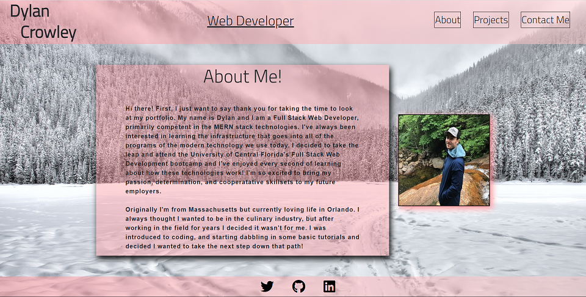

# REACT PORTFOLIO

This is my personal React Developer Portfolio!

[Link to live site](https://dcrowdev.github.io/challenge20-React-Portfolio/)

## Description

This is a basic react portfolio built using create-react-app.

### Installing

No installation necessary.

### Executing program

The navigation uses react to swiftly change views on the front end. You can read  
my personal 'About Me' section, some of my Javascript projects, my resume, or send me an  
email by filling out the contact form.

### Testing

No testing currently available.

## Authors

Dylan Crowley:

[Github](https://github.com/dcrowdev)  
[Twitter](https://twitter.com/dcrowdev)  
[LinkedIn](https://www.linkedin.com/in/dylan-crowley-3974b8252/)  
dcrowdev1025@gmail.com

## License

This project is licensed under the MIT license.

## Acknowledgments

UCF Fullstack bootcamp!
